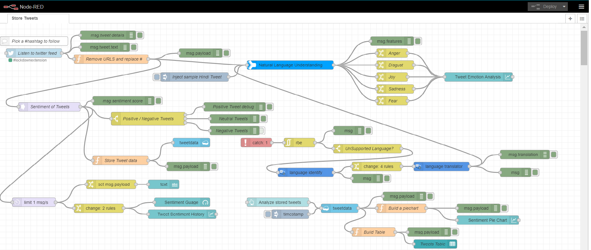
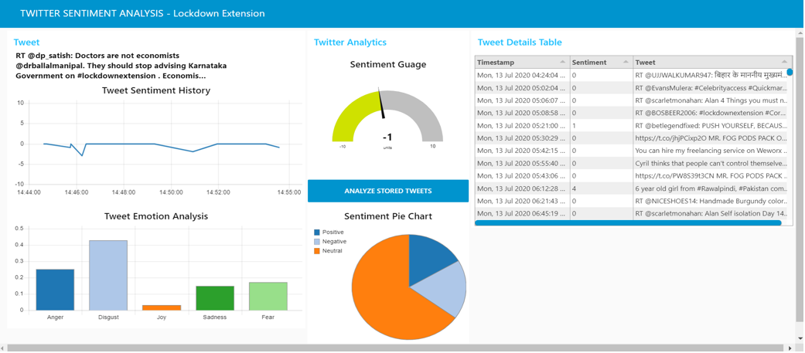
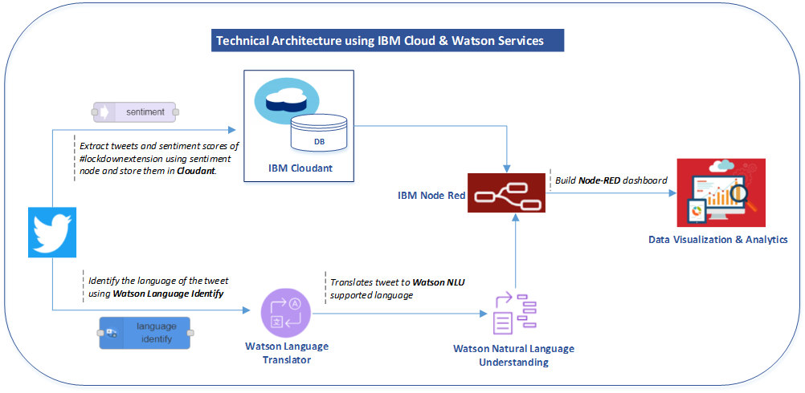
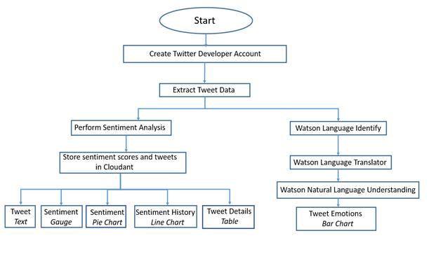

# Twitter Sentiment Analysis – Lockdown Extension #
Predictive Analytics Model and Visualization dashboards which analyzes public sentiment on lockdown extension using powerful Watson Cognitive services.

## IBM Cloud and Watson Services: ##
* IBM Cloudant
* Watson Natural Language Understanding
* Watson Language Translator
* Watson Language Identify
* Node-RED

## Workflow ##
* Extract tweets on #lockdownextension.
* Perform sentiment analysis, store the tweets and their respective sentiment scores in **Cloudant** database.
* Use **Watson Language Identify** and **Watson Language Translator** to identify and translate tweets respectively, which are of languages not accepted by Watson NLU.
* Extract tweet emotions using **Watson Natural Language Understanding**.
* **Node-RED** to build dashboards of the analysis obtained.

Scroll down in this README to preview the screenshots of the Node-RED flows.

## Model FLow ##

##  Visualization Dashboard ##

## PPT Link ##
[https://drive.google.com/file/d/1HbvFv5LEGFjWitaOEoDtEm9XMdIjH-DL/view?usp=sharing](https://drive.google.com/file/d/1HbvFv5LEGFjWitaOEoDtEm9XMdIjH-DL/view?usp=sharing)

## Video Link ##
[https://www.youtube.com/watch?v=9P0u71BuVXc](https://www.youtube.com/watch?v=9P0u71BuVXc)

## Flow Diagrams ##

